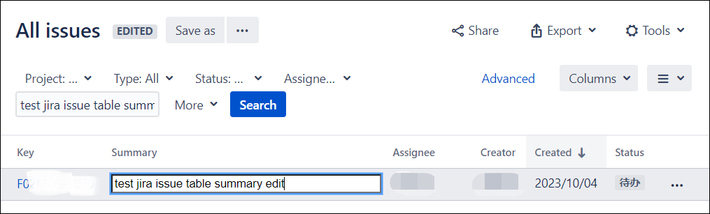

<h1 align="center">jira-issueTable-quicker</h1>

This is a browser plug-in that helps us quickly edit questions on the question form page

   
    

# Features
[jira](https://www.atlassian.com/software/jira) is a tool that can help effectively improve work efficiency, but when we use jira, using the issue form allows us to see more content without paying attention to details. However, currently the issue form page cannot be edited quickly, based on This question, with this plug-in, the sample function is as follows:

Original table content.

After using the plug-in, double-click the summary field to turn it into an input box, and you can modify the summary directly.

# How to use？
 1. Enter the browser extension management page;
 2. Open browser developer options;
 3. Load the unzipped extension;
 4. Select src directory.

# Implemented
 - ✅ Double-click to edit summary field;
 - ⬜️ Double-click other fields to edit.
